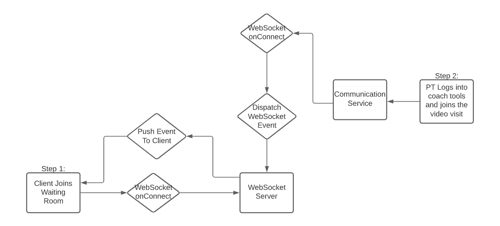

# PoC for Web Sockets (with Elixir!)

## Summary

Really should have thought of something to write here...

## Architecture



## How to Run
#

Terminal 1 (Server)
```sh
iex -S mix phx.server
```
This will allow for an interactive shell into the running server.

Terminal 2 (Client)
```sh
npm start
```
Should open a browser window with the client

### Test it out
In the Server terminal:
```sh
ServerWeb.Endpoint.broadcast!("room:1", "myEvent", %{test: "stuff"})
```

"Coach" goes to http://localhost:3000/viewdata
"User" goes to http://localhost:3000/


ngrok:

2 terminals:
Client
```sh
ngrok http 3000
```
Server (Websockets)
```sh
ngrok http 4000
```
replace `client/src/ViewData.js` websockets localhost:4000 with the ngrok link from the server.

## First Time Set up
#

Requirements:
* Elixir Installed on system
* Node / npm installed on system
* postgres installed on system


```sh
cd server
mix deps.get
cd ../client
npm i
```

Configure Postgres

```sh
psql
create database server_db;
grant all privileges on database server_db to my_user;
exit
mix deps.get
mix ecto.create
mix ecto.migrate
```